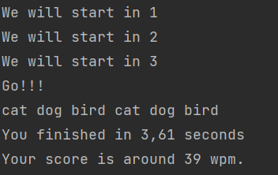

<div id="top"></div>

<!-- PROJECT SHIELDS -->

<!-- PROJECT LOGO -->
<br />
<div align="center">
  <a href="https://github.com/christopher-chandler/WPM">
    
  </a>

![Version][Version-shield]  [![MIT License][license-shield]][license-url] ![update][update-shield]

[![Stargazers][stars-shield]][stars-url]

![Windows][windows-shield] ![Mac][Mac-shield]


<h3 align="center">WPM </h3>

  <p align="center">
    A program to calculate the words per minute that you can type.
    <br />
    <a href="https://christopher-chandler.github.io/WPM/"><strong>Explore the docs »</strong></a>
    <br />
    <br />
    <a href="https://github.com/christopher-chandler/WPM/issues">Report Bug</a>
    ·
    <a href="https://github.com/christopher-chandler/WPM/issues">Request Feature</a>
  </p>
</div>


<!-- TABLE OF CONTENTS -->
<details>
  <summary>Table of Contents</summary>
  <ol>
    <li>
      <a href="#about-the-project">About The Project</a>
      <ul>
        <li><a href="#built-with">Built With</a></li>
      </ul>
    </li>
    <li>
      <a href="#getting-started">Getting Started</a>
      <ul>
        <li><a href="#prerequisites">Prerequisites</a></li>
        <li><a href="#installation">Installation</a></li>
      </ul>
    </li>
    <li><a href="#usage">Usage</a></li>
    <li><a href="#roadmap">Roadmap</a></li>
    <li><a href="#contributing">Contributing</a></li>
    <li><a href="#license">License</a></li>
    <li><a href="#contact">Contact</a></li>
    <li><a href="#acknowledgments">Acknowledgments</a></li>
  </ol>
</details>


<!-- ABOUT THE PROJECT -->
## About The Project

<div align="center">
  <a href="https://github.com/christopher-chandler/WPM">
    
  </a>

<p align="right">(<a href="#top">back to top</a>)</p>
</div>


### Built With
This program is written in pure Java without external dependencies.

<p align="right">(<a href="#top">back to top</a>)</p>


<!-- GETTING STARTED -->
## Getting Started
To run WPM,  you simply need to execute ```java -jar WordsPerMinute.jar``` in the command prompt. 


### Prerequisites

You must have [Java](https://www.oracle.com/java/technologies/downloads/) installed on your local machine with the JVM.

### Installation

An installation of the program is not required. It is portable and can be run so long as you have 
Java installed on your system.

<p align="right">(<a href="#top">back to top</a>)</p>

<!-- USAGE EXAMPLES -->
## Usage

This is a simple program that you can use to gauge how fast you can type our words. 

### Basic Mode 


After running the jar file, you will be presented with three words. 
Enter the words as fast and accurately as you can. Once you are done, you must 
press the enter key. The result will the presented in the console.

<p align="right">(<a href="#top">back to top</a>)</p>

<!-- ROADMAP -->
## Roadmap

A list of features that are to be implemented in future releases. 

- [ ] Accuracy score
  - [ ] Saving user scores
- [ ] Loading in user files 

See the [open issues](https://github.com/christopher-chandler/WPM/issues) for a full list of proposed features (and known issues).

<p align="right">(<a href="#top">back to top</a>)</p>


<!-- CONTRIBUTING -->
## Contributing

Contributions are what make the open source community such an amazing place to learn, inspire, and create. Any contributions you make are **greatly appreciated**.

If you have a suggestion that would make this better, please fork the repo and create a pull request. You can also simply open an issue with the tag "enhancement".
Don't forget to give the project a star! Thanks again!

1. Fork the Project
2. Create your Feature Branch (`git checkout -b feature/AmazingFeature`)
3. Commit your Changes (`git commit -m 'Add some AmazingFeature'`)
4. Push to the Branch (`git push origin feature/AmazingFeature`)
5. Open a Pull Request

<p align="right">(<a href="#top">back to top</a>)</p>


<!-- LICENSE -->
## License

Distributed under the MIT License. See `LICENSE.txt` for more information.

<p align="right">(<a href="#top">back to top</a>)</p>


<!-- CONTACT -->
## Contact

Christopher Chandler - christopher.chandler@outlook.de

Project Link: [https://github.com/christopher-chandler/WPM](https://github.com/christopher-chandler/WPM)

<p align="right">(<a href="#top">back to top</a>)</p>

<!-- ACKNOWLEDGMENTS -->
## Acknowledgments

* This projected is based and inspired by [Alex Lee's WPM in Java](https://www.youtube.com/watch?v=Dzx0-9cTIMc)

<p align="right">(<a href="#top">back to top</a>)</p>


<!-- MARKDOWN LINKS & IMAGES -->
<!-- https://www.markdownguide.org/basic-syntax/#reference-style-links -->

[contributors-shield]: https://img.shields.io/github/contributors/christopher-chandler/WPM?color=green&logoColor=%20
[contributors-url]: https://github.com/christopher-chandler/WPM/graphs/contributors

[stars-shield]: https://img.shields.io/github/stars/christopher-chandler/wpm?color=%20&logoColor=yellow&style=social
[stars-url]: https://github.com/christopher-chandler/WPM/stargazers

[license-shield]: https://img.shields.io/github/license/christopher-chandler/WPM?color=yellow
[license-url]: https://github.com/christopher-chandler/WPM/blob/master/LICENSE

[download-shield]: https://img.shields.io/github/downloads/christopher-chandler/WPM/total
[windows-shield]:  https://img.shields.io/badge/Windows-Tested-purple
[mac-shield]: https://img.shields.io/badge/Mac-Tested-purple
[version-shield]: https://img.shields.io/badge/Version-0.0.1-brightgreen
[update-shield]: https://img.shields.io/badge/Last_Updated-March_2022-blue

 